# Ambienti di Sviluppo - Guida Completa

- Usa sempre HTTPS in produzione
- Configura ALLOWED_HOSTS con domini specifici
- Non usare mai DEBUG=True in produzione
- Usa password complesse per database
- Configura backup automatici
- Monitora metriche e log
- Usa secrets e variabili d'ambiente, mai hardcoded

## 🔍 Troubleshooting

Consulta la sezione FAQ qui sotto e la guida [Database Security](database-security.md) per problemi comuni.

## 🔗 Cross-link documentazione

Consulta anche:

- [Database Setup](database-setup.md)
- [Database Security](database-security.md)
- [Just Commands](just.md)

## 🌍 Ambienti di Sviluppo - Guida Completa

Questo progetto è configurato per funzionare con **4 ambienti distinti**, ognuno con il proprio scopo specifico nel
ciclo di sviluppo software.

## 📋 Panoramica Ambienti

| Ambiente    | Emoji | Database                      | Scopo                  | Utilizzo             |
| ----------- | ----- | ----------------------------- | ---------------------- | -------------------- |
| **DEV**     | 🔧    | SQLite (default) / PostgreSQL | Sviluppo locale rapido | Coding quotidiano    |
| **TEST**    | 🧪    | SQLite (default) / PostgreSQL | Test automatizzati     | CI/CD e test unitari |
| **STAGING** | 🎭    | PostgreSQL (obbligatorio)     | Pre-produzione         | UAT e test finali    |
| **PROD**    | ⚡    | PostgreSQL (obbligatorio)     | Produzione             | Sistema live         |

## 🔧 DEV - Ambiente di Sviluppo

### 🎯 Scopo DEV

- **Sviluppo quotidiano** e prototipazione rapida
- **Debug e sperimentazione** con nuove funzionalità
- **Test manuali** durante lo sviluppo

### ⚙️ Caratteristiche DEV

- **Database**: SQLite di default per velocità (switchable a PostgreSQL)
- **Debug**: Abilitato con toolbar e logging dettagliato
- **Performance**: Ottimizzato per velocità di riavvio
- **Logging**: Console e file per debug completo
- **Hot Reload**: Riavvio automatico del server su modifiche

### 🚀 Come usarlo DEV

```bash
# Server di sviluppo
just run-dev
# Test in ambiente dev
just test-dev
# Migrazioni
just migrate-dev
# Shell interattiva
just shell-dev
# Controllo configurazione
just check-env-dev
```

### 🧪 Testing

Per informazioni complete sui test, vedi: [**📋 Guida Testing Completa**](testing-guide.md)

```bash
# Test rapidi sicurezza
uv run manage.py test accounts.tests.SecurityTest --settings=home.settings.test_local
# Test completi
uv run manage.py test accounts --settings=home.settings.test_local
```

### 💡 Quando usarlo DEV

- Sviluppo di nuove funzionalità
- Debug di problemi
- Prototipazione rapida
- Test manuali durante il coding

---

## 🧪 TEST - Ambiente di Test

### 🎯 Scopo TEST

- **Test automatizzati** (unit test, integration test)
- **Continuous Integration** (CI/CD pipeline)
- **Validazione** del codice prima del merge

### ⚙️ Caratteristiche TEST

- **Database**: SQLite in memoria per velocità (switchable a PostgreSQL)
- **Debug**: Disabilitato per simulare produzione
- **Performance**: Ottimizzato per esecuzione veloce dei test
- **Logging**: Minimale per non interferire con i test
- **Isolamento**: Ogni test ha database pulito

### 🚀 Come usarlo TEST

```bash
# Test automatizzati
just test-test
# Server per test manuali
just run-test
# Migrazioni per test
just migrate-test
# Controllo configurazione test
just check-env-test
```

### 💡 Quando usarlo TEST

- Esecuzione di test automatizzati
- Pipeline CI/CD
- Validazione pre-merge
- Test di integrazione

---

## 🎭 STAGING - Ambiente di Pre-Produzione

### 🎯 Scopo STAGING

- **User Acceptance Testing (UAT)**
- **Test finali** prima del rilascio
- **Simulazione produzione** con dati quasi-reali
- **Demo** per stakeholder e clienti

### ⚙️ Caratteristiche STAGING

- **Database**: PostgreSQL obbligatorio (simula produzione)
- **Debug**: Disabilitato (come produzione)
- **Performance**: Configurazione simile alla produzione
- **Logging**: Su file con rotazione (come produzione)
- **Sicurezza**: Impostazioni di sicurezza attive
- **Cache**: Redis opzionale per test performance

### 🚀 Come usarlo STAGING

```bash
# Server staging
just run-staging
# Test in ambiente staging
just test-staging
# Migrazioni staging
just migrate-staging
# Shell staging
just shell-staging
# Controllo ambiente e logging
just check-env-staging
```

### 💡 Quando usarlo STAGING

- User Acceptance Testing (UAT)
- Demo per clienti/stakeholder
- Test finali pre-rilascio
- Validazione performance
- Test di integrazione con sistemi esterni

---

## ⚡ PROD - Ambiente di Produzione

### 🎯 Scopo PROD

- **Sistema live** utilizzato dagli utenti finali
- **Massima stabilità** e performance
- **Sicurezza** ai massimi livelli
- **Monitoring** e logging completi

### ⚙️ Caratteristiche PROD

- **Database**: PostgreSQL con backup automatici
- **Debug**: Completamente disabilitato
- **Performance**: Ottimizzazioni complete (cache, CDN, ecc.)
- **Logging**: Completo con rotazione e monitoring
- **Sicurezza**: HTTPS, HSTS, CSP, e tutte le protezioni attive
- **Scalabilità**: Configurato per load balancing

### 🚀 Come usarlo PROD

```bash
# Server produzione (solo per test locali!)
just run-prod
# Migrazioni produzione
just migrate-prod
# Shell produzione (ATTENZIONE!)
just shell-prod
# Controllo ambiente produzione
just check-env-prod
```

### ⚠️ Attenzione

- **Mai fare test** direttamente in produzione
- **Sempre backup** prima delle modifiche
- **Accesso limitato** solo al personale autorizzato
- **Monitoring attivo** 24/7

---

## 🔄 Workflow Tipico di Sviluppo

```mermaid
graph LR
    A[💻 DEV<br/>Sviluppo] --> B[🧪 TEST<br/>Automatici]
    B --> C[🎭 STAGING<br/>UAT]
    C --> D[⚡ PROD<br/>Release]
    B -.->|Fix Bug| A
    C -.->|UAT Failed| A
    D -.->|Hotfix| A
```



### 1. **Sviluppo** (DEV)

- Scrivi il codice
- Test manuali durante lo sviluppo
- Debug e sperimentazione

### 2. **Test Automatizzati** (TEST)

- Push del codice
- CI/CD esegue test automatici
- Validazione qualità codice

### 3. **Pre-Produzione** (STAGING)

- Deploy per UAT
- Test finali con dati reali
- Demo per stakeholder

### 4. **Produzione** (PROD)

- Deploy finale
- Sistema live
- Monitoring continuo

## 🔧 Configurazione Rapida

### Setup Iniziale

```bash
# 1. Genera password sicure per tutti gli ambienti
just generate-db-passwords
# 2. Configura PostgreSQL (per staging e prod)
# Segui: docs/database-setup.md
# 3. Testa tutti gli ambienti
just check-env-dev
just check-env-test
just check-env-staging
just check-env-prod
```

### Switch Database

```bash
# DEV: Passa da SQLite a PostgreSQL
# Nel file .env: USE_POSTGRESQL_DEV=1
# TEST: Passa da SQLite a PostgreSQL
# Nel file .env: USE_POSTGRESQL_TEST=1
# STAGING e PROD usano sempre PostgreSQL
```

## 📚 Documentazione Correlata

- [🗄️ Database Setup](database-setup.md) - Configurazione PostgreSQL
- [🔐 Database Security](database-security.md) - Gestione sicura password
- [⚙️ Environment Variables](environment-variables.md) - Variabili d'ambiente
- [🚀 Just Commands](just.md) - Tutti i comandi disponibili

## ❓ FAQ

### Quando usare SQLite vs PostgreSQL?

- **SQLite**: Per sviluppo rapido e test veloci (DEV/TEST)
- **PostgreSQL**: Per simulare produzione e deployment (STAGING/PROD)

### Posso saltare l'ambiente STAGING?

- **No**, è fondamentale per UAT e test finali
- Previene problemi in produzione
- Necessario per demo e validazione cliente

### Come gestisco i dati sensibili?

- Mai committare file `.env`
- Usa `just generate-db-passwords` per password sicure
- Vedi [Database Security](database-security.md)

### Come debuggo problemi di ambiente?

```bash
# Usa i comandi check-env per ogni ambiente
just check-env-dev
just check-env-staging
just check-env-prod
```
